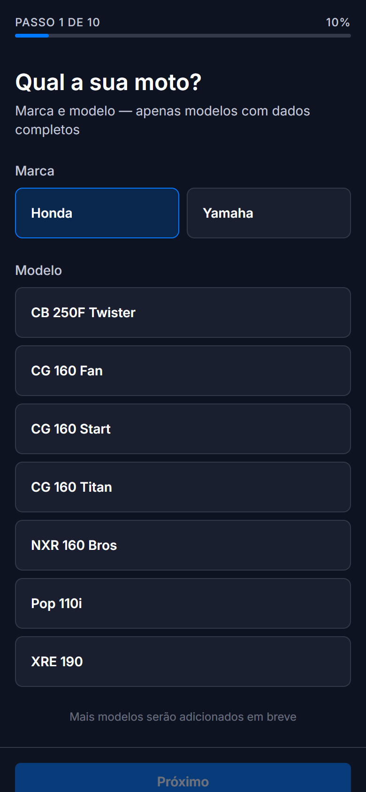
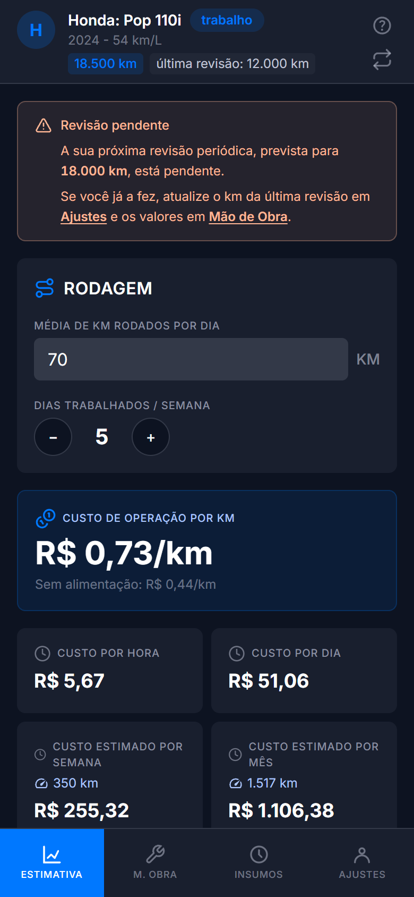
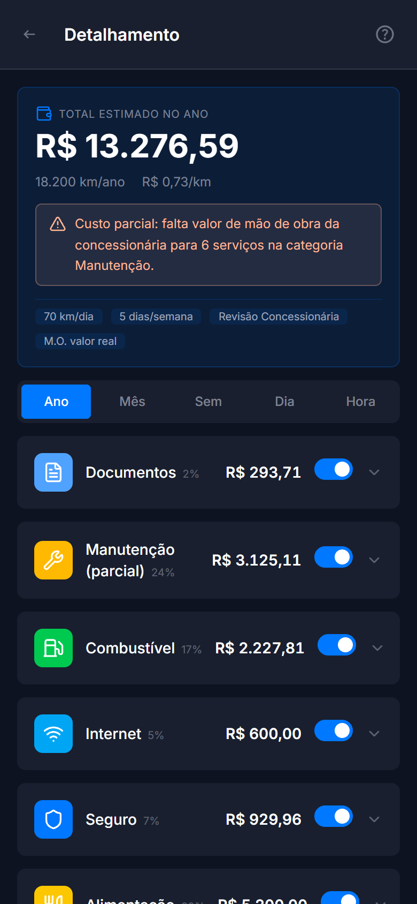

<h1 align="center">MotoCustoRJ</h1>

<p align="center">
  <strong>Quanto custa, de verdade, trabalhar de moto no Rio de Janeiro?</strong><br>
  Calculadora PWA offline-first que estima o custo real de operar uma motocicleta de trabalho —
  por km, hora, dia, semana, mês e ano.
</p>

<p align="center">
  <a href="https://motocustorj.vercel.app"></a>
  
  
  
  <a href="https://github.com/thiagoroddev/motocustorj/actions/workflows/verificacao.yml"></a>
  <a href="./LICENSE.md"></a>
</p>

<p align="center">
  <a href="https://motocustorj.vercel.app"><strong>▶ Abrir o app</strong></a> ·
  <a href="./docs/uso-de-ia.md">Uso de IA</a> ·
  <a href="./docs/arquitetura/ADR/">Decisões (ADRs)</a> ·
  <a href="./docs/tarefas/">Tarefas</a>
</p>

---

> **Status:** concluído e publicado. Escopo entregue por completo — onboarding, cálculo,
> detalhamento por categoria, edição e PWA offline — e em uso no endereço acima.
> Desenvolvido entre maio e julho de 2026.

<!--
  TODO(autor): inserir aqui 2-4 capturas reais do app (celular) para dar rosto ao projeto.
  Sugestão: Onboarding · Estimativa (home) · Detalhamento por categoria · Edição de peças.
  Salvar em docs/design/screenshots/ e usar:

  <p align="center">
    
    
    
    
  </p>
-->

## O problema

Entregadores de moto enxergam bem o gasto com combustível, mas subestimam o resto: manutenção,
desgaste de peças, revisões, documentação, seguro, financiamento, alimentação e imprevistos. O
resultado é um ganho líquido que parece maior do que é — e preço de corrida formado no chute.

O MotoCustoRJ transforma os dados da moto e da rotina de trabalho em uma estimativa de custo
explicável, mostrando de onde vem cada número e permitindo que o usuário substitua qualquer valor
pela realidade dele.

É um **estimador de custo operacional** — não um sistema contábil, nem um rastreador de corridas,
nem uma promessa de gasto exato futuro.

## O que faz

- **Onboarding guiado** (10 passos) para configurar moto, rotina de trabalho e custos pessoais
- **Estimativa por granularidade**: km, hora, dia trabalhado, semana, mês e ano
- **Detalhamento por categoria**: combustível, manutenção, revisão, seguro, alimentação e outros
- **Transparência de origem**: cada valor é marcado como oficial, editado, estimado ou ausente
- **Totalmente editável**: presets, preços de peças, mão de obra e últimas manutenções
- **Local-first**: persistência apenas no navegador — nenhum dado sai do aparelho, sem conta e sem backend
- **PWA instalável**, com uso offline após o primeiro acesso — sem depender de loja de apps
- **14 modelos** populares de Honda e Yamaha, de 110cc a 250cc (Pop 110i, Factor 125i, CG 160,
  Fazer 250, Lander 250, XRE 190, FZ25, entre outros)

## Stack

| Camada | Tecnologia |
|---|---|
| Framework | React 19 + Vite 6 |
| Linguagem | TypeScript 5.8 (`strict`) |
| Estilos | Tailwind CSS v4 + shadcn/ui (Radix) |
| Roteamento | React Router v7 (modo biblioteca) |
| Estado | Context + `useReducer` |
| Validação | Zod v4 (schema de runtime na leitura do storage) |
| Testes | Vitest + Testing Library |
| Lint | ESLint v9 (flat config) + Prettier |
| PWA | `vite-plugin-pwa` (Workbox) |
| Deploy | Vercel |

## Engenharia

O que eu considero a parte interessante deste projeto não é o cálculo — é o rastro.

| | |
|---|---|
| **466 testes** em 43 arquivos | cálculo, domínio, persistência e fluxos de UI ponta a ponta |
| **22 ADRs** | toda decisão estrutural registrada, inclusive as revertidas |
| **~197 tarefas** concluídas | arquivo próprio e datado, com o que foi feito e o que ficou fora |
| **4 revisões gerais** de código | achados anexados de volta às tarefas de origem |
| **~190 arquivos** TS/TSX | domínio, cálculo e UI separados por camada |
| **Dados versionados** | link e captura de cada fonte pública consultada, por modelo |

Decisões notáveis: **local-first sem backend** (privacidade e custo zero de operação para um público
que não quer criar conta); **presets imutáveis + overrides no perfil** (atualizar um preset não
corrompe a configuração de quem já usa — o cálculo reconcilia contra o preset canônico); **nenhuma
API em runtime** (o app funciona offline em 4G ruim, que é o cenário real do usuário).

## Desenvolvimento assistido por IA

Este projeto foi desenvolvido com apoio de assistentes de IA, e isso é declarado de propósito.

Eu decidi produto, arquitetura, modelagem de domínio e recorte de tarefa; pesquisei e conferi
manualmente todos os dados reais; e revisei e aceitei cada entrega. A IA atuou como executora dentro
de tarefas especificadas, guiada por pacotes de instrução versionados no próprio repositório
([`.github/agents/`](./.github/agents/)) e por um documento de contexto do produto
([`docs/contexto-projeto-ai.md`](./docs/contexto-projeto-ai.md)).

Nenhum dado de domínio é gerado por IA, e **não há qualquer chamada a LLM no app publicado** — a IA é
ferramenta de desenvolvimento, não parte do runtime.

**→ O detalhamento completo (divisão de responsabilidade, ciclo de tarefa, como auditar) está em
[`docs/uso-de-ia.md`](./docs/uso-de-ia.md).**

## Como rodar

```bash
npm install
npm run dev        # servidor de desenvolvimento
npm run verify     # typecheck + lint + testes (o que rodo antes de aceitar qualquer tarefa)
npm run build      # build de produção
```

Outros scripts: `npm run test`, `npm run lint`, `npm run typecheck`, `npm run format`,
`npm run fipe:check` (dry-run da atualização de FIPE).

## Deploy

App client-only: `npm run build` gera `dist/`, servido como site estático. Hospedado na Vercel com
build automático a partir do repositório; `vercel.json` cuida do fallback de rotas SPA. Service
worker e manifest do PWA são gerados no build.

## Fontes de dados

Os valores são **referências coletadas de fontes públicas** e podem estar desatualizados — o app
exibe a origem ao lado de cada dado. Nenhuma fonte é consultada em tempo de execução: os dados ficam
embutidos nos presets e são atualizados manualmente.

| Dado | Fonte |
|---|---|
| Valor do veículo (FIPE) | **API Parallelum FIPE** (`parallelum.com.br/fipe`) — coletada por script (`scripts/atualizar-fipe-presets.mjs`) e embutida nos presets |
| Preço de combustível | **ANP** — Levantamento de Preços de Combustíveis (pesquisa semanal), município do Rio de Janeiro |
| IPVA | **SEFAZ-RJ** — Lei nº 2877/97 e alterações (alíquota de motos) |
| Licenciamento (CRLV) | **DETRAN-RJ** — valor anual do estado do RJ |
| Revisões e mão de obra | **Sites oficiais das concessionárias** Honda e Yamaha |
| Preços de peças e pneus | **Marketplaces** (Mercado Livre, Shopee) e lojas de peças genuínas/OEM (Tração Motos Yamaha, Paulinho Motos) |

Links e capturas de cada coleta ficam versionados por modelo em
[`docs/dominio/informacoes-modelos-motos/`](./docs/dominio/informacoes-modelos-motos/).

## Evoluções mapeadas

O escopo definido foi entregue. O que ficou de fora está documentado em vez de esquecido — cada item
abaixo tem tarefa registrada em [`docs/tarefas/pendentes.md`](./docs/tarefas/pendentes.md), com
motivo e critério de aceite:

- Code-splitting do bundle principal — chunk único acima de 500 kB penaliza o 1º acesso em 4G
- Auditoria de performance e acessibilidade (Lighthouse, WCAG, alvos de toque de 48px)
- Analytics de uso com Umami (privacy-first, sem cookies)
- Publicação na Google Play Store via TWA, sobre o PWA atual
- Comparação de custo entre motos

Fora do escopo por decisão registrada (ADR-003): tela de Registros, formulários de
rodagem/abastecimento e cálculo baseado em histórico diário — adiados deliberadamente para manter o
produto focado na estimativa.

## Documentação

| Assunto | Arquivo |
|---|---|
| Uso de IA no desenvolvimento | [`docs/uso-de-ia.md`](./docs/uso-de-ia.md) |
| Contexto do projeto (IA e devs) | [`docs/contexto-projeto-ai.md`](./docs/contexto-projeto-ai.md) |
| ADRs (decisões arquiteturais) | [`docs/arquitetura/ADR/`](./docs/arquitetura/ADR/) |
| Requisitos funcionais | [`docs/requisitos/funcionais.md`](./docs/requisitos/funcionais.md) |
| Regras de negócio | [`docs/requisitos/regras-negocio.md`](./docs/requisitos/regras-negocio.md) |
| Requisitos não funcionais | [`docs/requisitos/nao-funcionais.md`](./docs/requisitos/nao-funcionais.md) |
| Convenções de código | [`docs/arquitetura/convencoes.md`](./docs/arquitetura/convencoes.md) |
| Design e tokens | [`docs/design/tema-tailwind.md`](./docs/design/tema-tailwind.md) |
| Glossário do domínio | [`docs/dominio/_glossario.md`](./docs/dominio/_glossario.md) |
| Tarefas e backlog | [`docs/tarefas/`](./docs/tarefas/) |
| Dados de pesquisa por modelo | [`docs/dominio/informacoes-modelos-motos/`](./docs/dominio/informacoes-modelos-motos/) |

Toda decisão tomada ao longo do projeto é rastreável entre tarefas e ADRs — o raciocínio de
desenvolvimento fica disponível, e não só o resultado.

## Autor

**Thiago Silva Rodrigues** — [github.com/thiagoroddev](https://github.com/thiagoroddev)

Desenvolvido como **Atividade Extensionista — Trabalho Final** (RU: 4647621), entre maio e julho de
2026.

## Licença

Copyright © 2026 Thiago Silva Rodrigues. Todos os direitos reservados, exceto os concedidos pela
licença.

Distribuído sob a **[PolyForm Noncommercial License 1.0.0](./LICENSE.md)** — uma licença
*source-available* (código aberto à consulta, **não** open-source no sentido OSI).

- **Permitido:** usar, estudar, modificar e compartilhar o código para **fins não comerciais** — uso
  pessoal, pesquisa, estudo, projetos de hobby e por organizações sem fins lucrativos, educacionais
  ou governamentais.
- **Não permitido:** qualquer **uso comercial** do código ou de obras derivadas, sem autorização
  expressa e por escrito do autor.

O autor mantém a titularidade integral dos direitos sobre o projeto e reserva-se o direito de
explorá-lo comercialmente e de licenciá-lo sob outros termos no futuro. Para licenciamento
comercial, entre em contato.
