# Guia para o Trabalho Final de Atividade Extensionista

> Material de apoio para adaptação pessoal. Os textos abaixo são exemplos e não devem ser
> entregues sem revisão. Substitua os trechos entre colchetes por experiências e evidências reais.

## 1. Leitura do modelo

O formulário possui duas etapas no mesmo arquivo:

- **Validação da proposta:** título, setor de aplicação, ODS, objetivos e metodologia.
- **Trabalho final:** atualização do que foi proposto, resultados esperados/obtidos e
  considerações finais.

Na entrega final, marque **Trabalho final**. Revise também os campos já preenchidos na proposta,
pois o produto mudou de nome e parte do escopo foi ajustada durante o desenvolvimento.

### O que cada seção pede

| Seção | O que precisa aparecer |
|---|---|
| Título | Nome curto que identifique o sistema, o público e o problema tratado. |
| Setor de aplicação | Público externo beneficiado e recorte geográfico ou profissional. |
| ODS | Relação real entre o projeto e os objetivos selecionados. |
| Objetivos | Um objetivo geral e objetivos específicos observáveis. |
| Metodologia | Um diagrama com o caminho do início ao fim e uma explicação das etapas. |
| Resultados | Ações realizadas, efeitos observados e pelo menos uma evidência. |
| Considerações finais | No mínimo três aprendizados e/ou dificuldades da execução. |

## 2. Contexto comprovado pelo projeto

O nome atual do produto é **EstimaMoto**. "MotoCalc RJ" foi o nome usado na proposta inicial e
ainda aparece em documentos históricos.

O problema tratado é a dificuldade de entregadores de moto perceberem custos que não aparecem
imediatamente no abastecimento, como desgaste de peças, revisões, documentação, seguro,
financiamento, alimentação e imprevistos. O sistema converte esses dados em estimativas por
quilômetro, hora, dia, semana, mês e ano.

O projeto é uma aplicação web mobile-first, gratuita e local-first. Os dados são armazenados no
navegador, sem conta e sem servidor. No estado atual, **o PWA e o funcionamento offline completo
ainda não foram implementados**. Portanto, o trabalho final não deve afirmar que esse objetivo foi
totalmente alcançado.

O histórico de tarefas comprova, entre outras entregas:

- onboarding para configuração da moto, rodagem e custos pessoais;
- estimativa e detalhamento dos custos operacionais;
- edição de combustível, peças, manutenção, mão de obra e despesas;
- interface mobile-first com áreas de toque e melhorias de acessibilidade;
- armazenamento local com validação e recuperação de dados inválidos;
- cálculos transparentes, com distinção entre valores oficiais, editados e estimados;
- testes automatizados, integração contínua e validações visuais;
- catálogo baseado em dados, com diversos modelos Honda e Yamaha no código atual;
- consulta e documentação de FIPE, revisões, peças e serviços por modelo;
- criação e alternância de múltiplas predefinições de veículos.

## 3. Pontos que exigem cuidado

### 3.1 Aplicação extensionista

O repositório comprova o desenvolvimento técnico, mas não comprova sozinho a interação com a
comunidade. Para caracterizar a extensão, registre apenas ações que realmente ocorreram, por
exemplo:

- conversa ou entrevista com entregadores;
- apresentação do protótipo e coleta de opinião;
- teste de uso acompanhado;
- consulta presencial ou por mensagem a oficina e fornecedor;
- comparação dos valores do sistema com a rotina real de um participante;
- orientação prática sobre custo por quilômetro e reserva para manutenção.

Se nenhuma ação externa foi realizada ainda, essa é a principal atividade a concluir antes da
entrega. Não invente nomes, depoimentos, quantidades ou resultados.

### 3.2 Promessas da proposta original

- Troque "custo operacional real" por **estimativa de custo operacional**. O aplicativo apoia o
  planejamento, mas não prevê com exatidão todos os gastos futuros.
- Escreva que o projeto é local-first, mas informe que o cache offline/PWA permanece como evolução.
- A pesquisa em manuais, FIPE e documentos está comprovada. Pesquisa de campo deve ser citada
  somente se tiver sido realizada por você.
- O recorte inicial é o Rio de Janeiro, principalmente por causa de IPVA, licenciamento e preços
  de referência.

## 4. Exemplos para preencher

### Título

**Opção mais atual:**

> EstimaMoto: estimativa de custos operacionais para entregadores de motocicleta

**Opção que preserva o vínculo com a proposta:**

> EstimaMoto (inicialmente MotoCalc RJ): apoio ao planejamento de custos de entregadores

### Setor de aplicação

> Trabalhadores autônomos que utilizam motocicleta em serviços de entrega por aplicativo,
> inicialmente no município do Rio de Janeiro. O projeto também pode apoiar motociclistas que
> precisam compreender os custos de uso profissional do veículo.

### ODS

Os três ODS marcados são defensáveis, mas precisam ser explicados:

- **ODS 4 - Educação de qualidade:** promove educação financeira aplicada à rotina de trabalho.
- **ODS 8 - Trabalho decente e crescimento econômico:** ajuda o trabalhador a estimar custos,
  analisar o ganho líquido e planejar o valor necessário para manter a atividade.
- **ODS 10 - Redução das desigualdades:** oferece gratuitamente uma ferramenta de informação para
  trabalhadores autônomos que normalmente não têm acesso a sistemas de gestão de custos.

**Exemplo de ligação entre os ODS e o projeto:**

> O projeto se relaciona principalmente com os ODS 4 e 8, pois transforma informações de
> combustível, manutenção e despesas em uma visão educativa do custo do trabalho. A relação com o
> ODS 10 ocorre pelo acesso gratuito a uma ferramenta de planejamento voltada a trabalhadores
> autônomos. Essa contribuição é de apoio e informação, não uma garantia de aumento de renda.

### Objetivo geral

> Desenvolver e aplicar uma ferramenta web gratuita e mobile-first que ajude entregadores de
> motocicleta a estimar o custo operacional da atividade de acordo com o veículo, a quilometragem
> e as despesas informadas, apresentando os valores de forma compreensível para apoiar o
> planejamento financeiro.

### Objetivos específicos

> - Identificar custos fixos e variáveis relevantes para o uso profissional de motocicletas,
> consultando manuais, tabelas FIPE, revisões, peças e referências regionais.
> - Organizar esses custos em estimativas por quilômetro, hora, dia, semana, mês e ano.
> - Criar uma interface adequada ao celular, com navegação orientada, áreas de toque amplas e
>   campos acessíveis.
> - Permitir que o usuário personalize consumo, combustível, rodagem, manutenção e despesas.
> - Explicar a origem dos valores e sinalizar quando um custo é oficial, editado, estimado,
>   incompleto ou indisponível.
> - Avaliar a utilidade da solução com [quantidade] participante(s) do público-alvo e registrar as
>   melhorias sugeridas.

### Metodologia

O formulário exige um diagrama, não apenas texto. Um fluxo coerente com o histórico do projeto é:

```mermaid
flowchart LR
    A["Identificação do problema"] --> B["Contato com o público-alvo"]
    B --> C["Pesquisa de custos e fontes"]
    C --> D["Definição de requisitos e cálculos"]
    D --> E["Prototipação mobile-first"]
    E --> F["Desenvolvimento do EstimaMoto"]
    F --> G["Testes técnicos e validação"]
    G --> H["Aplicação com participantes"]
    H --> I["Análise dos resultados e melhorias"]
```

Remova ou adapte a etapa "Contato com o público-alvo" caso ela ainda não tenha ocorrido. Na versão
final, porém, é recomendável realizá-la e documentá-la.

**Exemplo de texto para acompanhar o diagrama:**

> A metodologia foi organizada em etapas. Primeiro, delimitei o problema dos custos pouco visíveis
> no trabalho com motocicleta e o público de entregadores por aplicativo. Em seguida, levantei
> informações sobre combustível, manutenção, revisões, peças, FIPE e despesas recorrentes. Esses
> dados foram transformados em requisitos e regras de cálculo.
>
> Depois, desenvolvi uma interface voltada ao celular e implementei o sistema com React e
> TypeScript. O desenvolvimento ocorreu de forma incremental: cada funcionalidade foi registrada
> em tarefas, revisada e testada antes da próxima etapa. Foram criados testes automatizados para
> cálculos, armazenamento, onboarding e componentes da interface.
>
> Na aplicação extensionista, apresentei o sistema a [perfil e quantidade dos participantes] e
> pedi que realizassem [tarefas executadas no teste]. Registrei as dúvidas, dificuldades e
> sugestões sem coletar dados pessoais desnecessários. A partir do retorno, foram feitas
> [melhorias reais], e os resultados foram comparados com os objetivos definidos.

### Resultados esperados/obtidos

**Exemplo baseado apenas no que o repositório comprova:**

> Como resultado técnico, foi desenvolvida uma aplicação web mobile-first capaz de receber dados
> da motocicleta e da rotina do usuário e apresentar estimativas por diferentes períodos. O
> sistema permite alterar valores de combustível, peças, manutenção, mão de obra e despesas
> pessoais, evitando que uma configuração genérica seja tratada como realidade de todos.
>
> Também foram implementados recursos para explicar a composição do custo, identificar revisões
> pendentes e diferenciar valores oficiais, personalizados e estimados. Os dados permanecem no
> navegador e passam por validação antes de serem carregados. O projeto possui testes
> automatizados e verificações de qualidade para reduzir erros nos cálculos e na persistência.
>
> O objetivo de funcionamento offline completo não foi concluído nesta etapa. A aplicação funciona
> com dados locais depois de carregada, mas ainda depende da implementação de PWA e cache para
> garantir abertura sem internet. Essa limitação foi registrada como continuidade do projeto.

**Parágrafo que depende de aplicação real:**

> A solução foi apresentada a [quantidade] entregador(es) em [local ou formato] no dia [data]. Os
> participantes conseguiram [resultado observado]. A principal dificuldade foi [dificuldade real],
> e a sugestão mais recorrente foi [sugestão real]. Após a atividade, foi ajustado [item realmente
> alterado]. O efeito observado foi [resultado verificável], sem generalizar a experiência para
> todos os entregadores.

### Considerações finais

O modelo pede no mínimo três aprendizados. Um exemplo adaptável:

> O primeiro aprendizado foi perceber que o combustível é apenas uma parte do custo da atividade.
> Manutenção, pneus, revisões, documentação e despesas pessoais alteram significativamente a
> estimativa e precisam ser apresentados de forma compreensível.
>
> O segundo aprendizado foi que dados técnicos não devem ser tratados como universais. Modelo,
> ano, tipo de freio, consumo, preço das peças e política da concessionária mudam o cálculo. Por
> isso, o sistema passou a usar dados por modelo e a permitir personalização.
>
> O terceiro aprendizado foi a importância da transparência. Quando um preço não inclui peça ou
> quando a mão de obra é apenas estimada, esconder essa limitação produziria uma falsa sensação de
> precisão. A interface precisou comunicar a origem e a qualidade dos valores.
>
> Também enfrentei dificuldades para conciliar fontes diferentes, preservar dados já cadastrados
> durante mudanças no sistema e criar uma experiência simples para celular sem retirar detalhes
> importantes. Os testes automatizados e a validação gradual ajudaram a corrigir erros e a
> reorganizar o escopo.
>
> Por fim, a atividade com [participantes] mostrou que [aprendizado humano real]. Como continuidade,
> permanecem a implementação do PWA/offline completo, a ampliação da validação com entregadores e
> o acompanhamento da utilidade da estimativa na rotina.

## 5. Evidências recomendadas

O formulário aceita fotos, tabelas, códigos, vídeos ou áudios. Uma combinação enxuta e forte seria:

1. **Captura do onboarding**, mostrando a configuração da moto e da rodagem.
2. **Captura da tela de estimativa**, com custo por quilômetro e por período.
3. **Captura do detalhamento**, mostrando categorias e explicação da origem dos valores.
4. **Tabela antes/depois**, com uma sugestão de participante e a mudança realizada.
5. **Foto da aplicação**, somente com autorização, ou registro sem rosto/dados pessoais.
6. **Link do repositório ou vídeo curto**, mostrando o fluxo completo em dois a cinco minutos.

Exemplo de tabela:

| Situação observada | Ação realizada | Efeito |
|---|---|---|
| Participante não entendeu se o valor incluía a peça | Separação entre valor completo e incompleto | Origem do custo ficou mais explícita |
| Dificuldade para tocar ou identificar um campo | Associação de rótulos e teclado numérico adequado | Preenchimento no celular ficou mais direto |
| Usuário precisava comparar períodos | Exibição por dia, semana, mês e ano | Facilitou relacionar custo e rotina de trabalho |

Use a tabela somente para situações que possam ser demonstradas. As duas primeiras linhas têm
correspondência com melhorias técnicas do projeto, mas não devem ser atribuídas a participantes
sem um registro real dessa origem.

## 6. Fontes internas úteis para conferir os fatos

- `docs/contexto-projeto-ai.md`: problema, público, escopo, arquitetura e estado do produto.
- `docs/tarefas/concluidas/0-indice-concluidas.md`: índice cronológico das entregas.
- `docs/tarefas/concluidas/2026-05-24--08h19--TASK-RNF-10.md`: acessibilidade dos campos.
- `docs/tarefas/concluidas/2026-05-29--14h44--TASK-RF-6.17.md`: distribuição dos custos.
- `docs/tarefas/concluidas/2026-05-30--17h13--TASK-RNF-10.md`: validação dos dados locais.
- `docs/tarefas/concluidas/2026-06-01--17h20--TASK-TEST-002.md`: testes de fluxo.
- `docs/tarefas/concluidas/2026-06-05--15h45--TASK-RF-6.27.md`: aviso de revisão.
- `docs/tarefas/concluidas/2026-06-07--23h26--TASK-RF-6.31.3.md`: fluxo do onboarding.
- `docs/tarefas/concluidas/2026-06-12--14h20--TASK-BG-031.md`: múltiplas predefinições.
- `docs/tarefas/concluidas/2026-06-13--14h25--TASK-DOM-4.md`: inclusão de modelo por dados.
- `docs/tarefas/concluidas/2026-06-14--16h43--TASK-DOM-5.md`: pesquisa e documentação Honda.

## 7. Checklist antes de entregar

- [ ] Marcar "Trabalho final".
- [ ] Atualizar o título para EstimaMoto ou explicar o nome anterior.
- [ ] Corrigir "Progressive Wev App" para "Progressive Web App", se o termo permanecer.
- [ ] Não afirmar que o PWA/offline completo está pronto.
- [ ] Não chamar a estimativa de gasto exato.
- [ ] Inserir o diagrama da metodologia como imagem legível.
- [ ] Informar quem participou da aplicação, sem expor dados pessoais.
- [ ] Relacionar ações e efeitos, não apenas listar funcionalidades.
- [ ] Anexar evidências reais e identificá-las no texto.
- [ ] Incluir pelo menos três aprendizados.
- [ ] Revisar ortografia, datas, links e autorização de uso de imagens/depoimentos.
